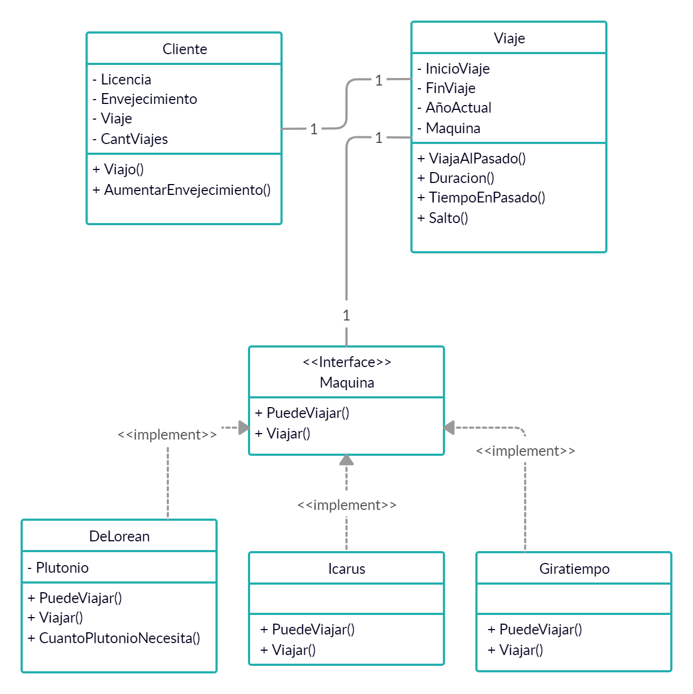

# Viajeros en el tiempo

_Una empresa se dedica a realizar viajes en el tiempo y nos pidió un sistema que los ayude a realizar un seguimiento de los viajes que efectúan sus clientes_

# Consigna

[Trabajo Práctico - Viajeros en el tiempo - 2019](https://docs.google.com/document/d/1yA0VYYyrCwBtCNndCojzEHlGTd-qjxrFUVE2TzrZUn0/edit?ts=5d9b9b93)

# Integrantes

+ [Sebastian Campos](https://github.com/scampos79)
+ [Braian Cariaga](https://github.com/bcariaga)
+ [Matias Dulce](https://github.com/Mdulce18)

# UML

----------
Photo by <a style="background-color:black;color:white;text-decoration:none;padding:4px 6px;font-family:-apple-system, BlinkMacSystemFont, &quot;San Francisco&quot;, &quot;Helvetica Neue&quot;, Helvetica, Ubuntu, Roboto, Noto, &quot;Segoe UI&quot;, Arial, sans-serif;font-size:12px;font-weight:bold;line-height:1.2;display:inline-block;border-radius:3px" href="https://unsplash.com/@peterlaster?utm_medium=referral&amp;utm_campaign=photographer-credit&amp;utm_content=creditBadge" target="_blank" rel="noopener noreferrer" title="Download free do whatever you want high-resolution photos from Pedro Lastra"><svg xmlns="http://www.w3.org/2000/svg" style="height:12px;width:auto;position:relative;vertical-align:middle;top:-2px;fill:white" viewBox="0 0 32 32"><path d="M10 9V0h12v9H10zm12 5h10v18H0V14h10v9h12v-9z"></path></svg>Pedro Lastra</a> 
